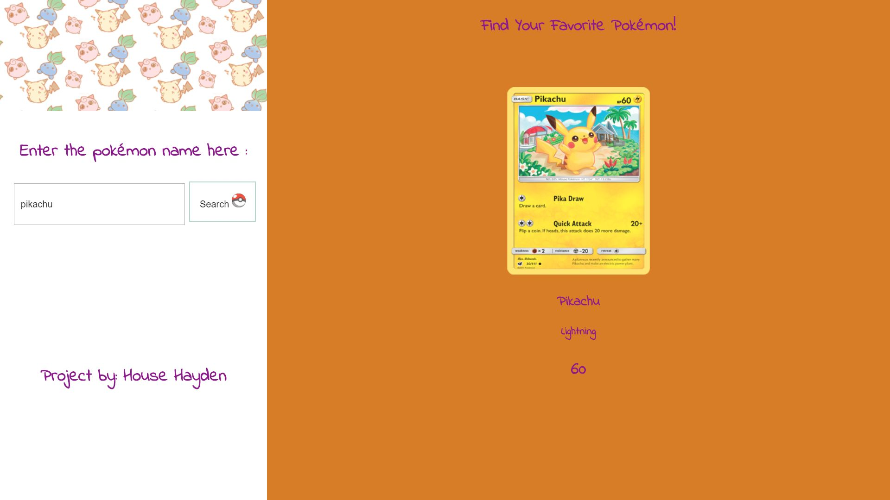

Pokemon API
This project used a pokemon API to allow a user to search for any pokemon they wanted and it display that pokemon's card, name, type, and hp.

Link to project:

How It's Made:
Tech used: HTML, CSS, JavaScript, jQuery, APIS
To create this project I started off by using an if statement that makes the user enter in a pokemon if they don't then they are greeted by an error message this is done by using an if statement. If they do enter the name than the image of that pokemon will be printed along with the name, type and hp. The image was printed to the DOM by using the attr method, the hp and pokemon name are printed into the DOM via the .html method and the eq method printed out the type that the pokemon is.

Lessons Learned:
I learned the importance of setting conditionals for inputs. Sometimes they aren't needed but for an app like this to work the user has to know if they're entering a pokemon name correctly because they can think they know
the spelling of a pokemon and continually enter that same word incorrectly and if I never inform them that what they aren't entering is true they might not use my app again. This can easily translate into the real world where
you have to make products very easy for the consumer to use if you don't you will lose them.

Examples:
Take a look at these couple examples that I have in my own portfolio:
